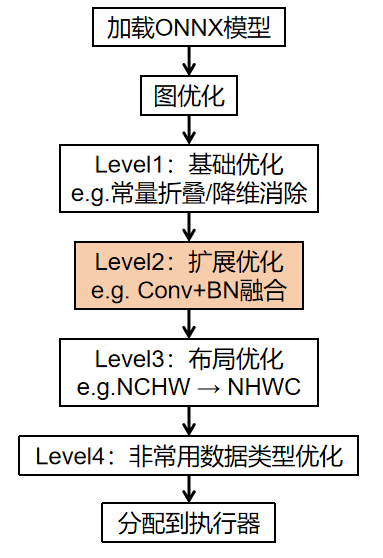
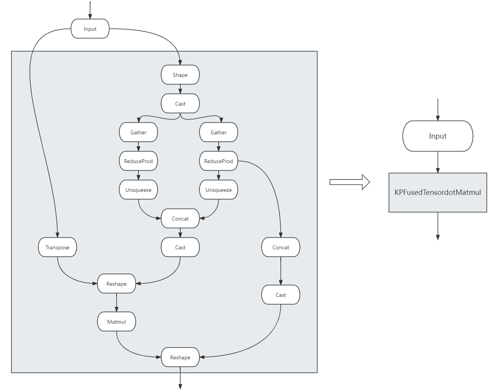
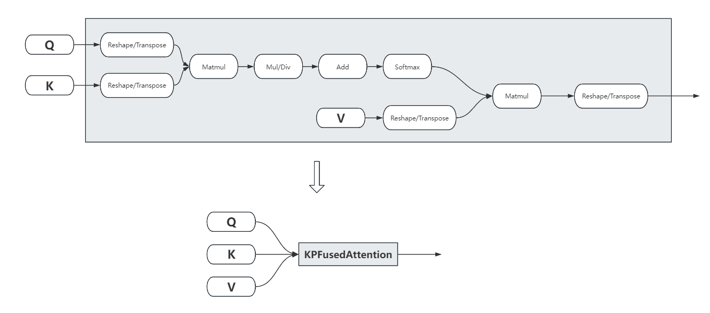
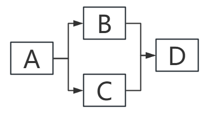
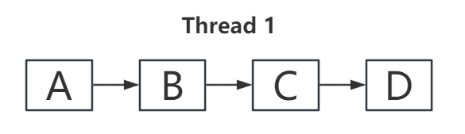
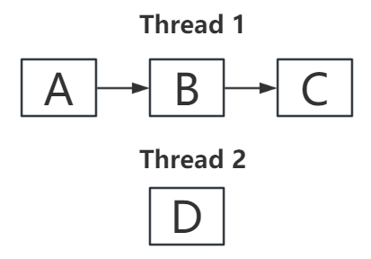

# 特性介绍

## Onnxruntime图优化

### 简介

为提升Onnxruntime的推理性能，鲲鹏Boostkit加强了Onnxruntime的图优化，聚焦于搜推广场景的模型，新增了三个常见的子图模式识别和融合，并且实现了高性能的融合算子，具有鲲鹏亲和的优化特性。基于开源Onnxruntime的v1.26.0版本，通过源码补丁的方式集成。当前支持如下算子：

- KPLayerNormalization

- KPFusedTensordotMatmul

- KPFusedAttention

### 实现原理

本章节介绍了Onnxruntime图优化特性的基本概念和实现原理。

Onnxruntime图优化整体流程如[**图 1** Onnxruntime图优化流程](#图优化流程)所示，鲲鹏Boostkit在Level2级别优化时，通过识别典型模型的子图，新增了三个图融合策略以及对应的高性能融合算子。

子图识别和融合策略通过`ApplyImpl`实现，它在方法内部**自行控制遍历策略**（通常按拓扑序遍历图中每个节点），对每个节点先递归进入子图，然后通过**锚点筛选**（如锁定某个特定 op 类型）定位候选子图入口，接着沿边逐跳匹配预定义的节点序列（逐个校验 `op_type`、`opset version`、`domain` 和边索引），匹配成功后对所有命中节点做**细粒度验证**（shape 约束、常量检查、EP 兼容性），最后执行**图重写**：合并权重常量、创建融合 op 节点并继承原 EP、将旧节点的输出边重连到新节点、批量删除中间节点。

**图 1** Onnxruntime图优化流程 

### 融合算子

#### KPLayerNormalization

KPLayerNormalization的子图如[**图 2** KPLayerNormalization示意图](#KPLayerNormalization示意图)所示，输入为`(X, Scale, Bias)`，所表示的计算过程为：

$$
y = \frac{X - \mu}{\sqrt{\sigma^2 + \epsilon}} \odot \gamma + \beta

$$

其中

$$
\mu = \text{ReduceMean}(X), \quad \sigma^2 = \text{ReduceMean}((X - \mu)^2)

$$

**图 2** KPLayerNormalization示意图 

#### KPFusedTensordotMatmul

KPFusedTensordotMatmul的子图如[**图 2** KPFusedTensordotMatmul示意图](#KPFusedTensordotMatmul示意图)所示，该融合算子识别 `tensotdot(A, B, axes=([rank(A) - 1], [0])` 操作，节省冗余的Reshape、Concat、Unsqueeze等操作来降低算子的开销。

**图 3** KPFusedTensordotMatmul 

#### KPFusedAttention

KPFusedAttention[**图 2** KPFusedAttention示意图](#KPFusedAttention示意图)所示，通过模式识别，将原有未融合的attention图结构匹配为KPFusedAttention，调用高性能KDNN MultiHeadAttention内核，一个内核完成matmul、add、softmax等全部操作，节省中间冗余的数据拷贝，并保持热数据常驻缓存，减少内存往返节省带宽。

**图 4** KPFusedAttention 

## Onnxruntime并行调度优化

### 简介

为提升 Onnxruntime 的推理性能，鲲鹏 Boostkit 强化了 Onnxruntime 的图执行引擎，针对搜推广场景中计算图节点间天然的拓扑并行性，实现了基于引用计数的节点级并行调度器 ParallelExecutor。

### 实现原理

假设有如[**图 5** 推理图](#推理图)所示的算子执行图，原本的执行如[**图 6** 串行执行图](#串行执行图)，每个算子的执行顺序在调度前已经决定为串行，引入鲲鹏并行调度器之后的执行顺序如[**图 7** 并行执行图](#并行执行图)所示，具有鲲鹏亲和的多核调度优化特性。

**图 5** 推理图 

**图 6** 串行执行图 

**图 7** 并行执行图 

该调度器以图拓扑为调度依据，为每个节点维护输入依赖计数，根节点直接入队就绪队列；多工作线程通过自旋-等待混合策略从共享就绪队列中拉取节点并发执行，节点完成后原子递减下游节点的引用计数，归零时立即触发下游节点入队，实现全图细粒度的流水线式并行调度。
